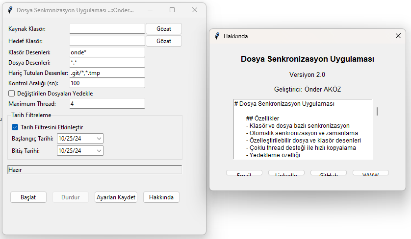

# Dosya ve Klasör Senkronizasyon Uygulaması


<div align="center">



*Dosya Senkronizasyon Uygulaması Ana Ekranı*

</div>

## 📋 Genel Bakış
Bu uygulama, klasörler arasında otomatik dosya senkronizasyonu sağlayan, kullanıcı dostu bir arayüze sahip Python tabanlı bir yazılımdır.

## ✨ Özellikler
- ✅ Klasör ve dosya bazlı senkronizasyon
- ✅ Otomatik senkronizasyon ve zamanlama
- ✅ Özelleştirilebilir dosya ve klasör desenleri
- ✅ Çoklu thread desteği ile hızlı kopyalama
- ✅ Yedekleme özelliği
- ✅ Detaylı loglama
- ✅ Kullanıcı dostu arayüz

## 🚀 Kurulum
1. Son sürümü indirin
2. `sync.exe` dosyasını çalıştırın
3. İlk çalıştırmada gerekli klasörler ve ayar dosyası otomatik oluşturulacaktır

## 📖 Kullanım Kılavuzu

### 1️⃣ Klasör Seçimi

- **Kaynak Klasör:** Senkronize edilecek dosyaların bulunduğu klasör
- **Hedef Klasör:** Dosyaların kopyalanacağı klasör

### 2️⃣ Desen Yapılandırması


> [!IMPORTANT]
> **Klasör Desenleri Örnekleri:**
> ```
> 9H-C*       # 9H-C ile başlayan klasörler
> TEST*       # TEST ile başlayan klasörler
> *DATA*      # İçinde DATA geçen klasörler
> ```

> [!NOTE]
> **Dosya Desenleri Örnekleri:**
> ```
> *.wgl       # Tüm .wgl dosyaları
> *.txt       # Tüm text dosyaları
> data*.xml   # data ile başlayan XML dosyaları
> ```

### 3️⃣ Zamanlama Ayarları
- **Kontrol Aralığı:** Senkronizasyon kontrolü için bekleme süresi (saniye)
- **Önerilen:** 10-60 saniye arası

### 4️⃣ Ek Ayarlar
- Dosya yedekleme
- Thread sayısı
- Tarih filtreleri

## ⚙️ Sistem Gereksinimleri
- Windows 7 veya üzeri
- Minimum 2GB RAM
- Python 3.8 veya üzeri (exe versiyonu için gerekli değil)

## 🛠️ Kaynak Koddan Derleme
```bash
# Gerekli paketleri yükle
pip install -r requirements.txt

# Exe dosyası oluştur
pyinstaller --onefile --windowed --icon=sync.ico --version-file=version.txt sync_app.py
```

## ⚠️ Hata Yönetimi


Sık karşılaşılan hatalar ve çözümleri:
- 🔴 "Kaynak klasör bulunamadı": Klasör yolunu kontrol edin
- 🔴 "Geçersiz desen": Klasör/dosya desenlerini doğrulayın
- 🔴 "Erişim reddedildi": Klasör izinlerini kontrol edin

## 📝 Sürüm Geçmişi

### v2.0.0 (2024-02-16)
- ✨ İlk sürüm
- ✨ Grafiksel kullanıcı arayüzü
- ✨ Çoklu thread desteği
- ✨ Tarih filtreleme
- ✨ Desen eşleştirme

## 📱 İletişim
- 📧 E-posta: [onder7@gmail.com]
- 🌐 GitHub: [github.com/onder7]

## ⚖️ Lisans
Bu proje MIT lisansı altında lisanslanmıştır.

## 🤝 Katkıda Bulunma
1. Fork edin
2. Feature branch oluşturun (`git checkout -b yeni-ozellik`)
3. Değişikliklerinizi commit edin (`git commit -am 'Yeni özellik eklendi'`)
4. Branch'inizi push edin (`git push origin yeni-ozellik`)
5. Pull Request oluşturun

## 🙏 Teşekkür
Bu projeye katkıda bulunan kendime teşekkürler.

---

> [!NOTE]
> Detaylı bilgi için [GitHub Wiki](https://github.com/onder7/File-Folder-Sync/wiki) sayfamızı ziyaret edin.

# File-Folder-Sync Application

<div style="color: #2E86C1">

## Overview
File-Folder-Sync is a Python-based application that provides automated file synchronization between folders.

</div>

<span style="color: #E74C3C">**Note:** This application requires Windows 7 or higher.</span>

## Features
- <span style="color: #27AE60">✓ Folder and file-based synchronization</span>
- <span style="color: #27AE60">✓ Automatic synchronization and scheduling</span>
- <span style="color: #27AE60">✓ Customizable file and folder patterns</span>

## Important Notes
- <span style="color: #E67E22">⚠️ Make sure to backup your data</span>
- <span style="color: #E74C3C">❌ Don't close the application while syncing</span>
- <span style="color: #27AE60">✓ Regular updates recommended</span>

## Installation Steps
1. <font color="blue">Download the latest release</font>
2. <font color="green">Run `sync.exe`</font>
3. <font color="orange">Configure your settings</font>

## Usage Guide
```diff
+ Recommended Settings
- Avoid These Settings
! Warning: Important Information
```

## Status Indicators
🟢 Active
🟡 Processing
🔴 Error

## Configuration Examples
<pre style="background-color: #f6f8fa">
<code style="color: #2E86C1">
folder_pattern = "9H-C*"
file_pattern = "*.wgl"
</code>
</pre>

<!-- GitHub Specific Styling -->
> [!NOTE]
> This is a highlighted note

> [!WARNING]
> This is a warning message

> [!IMPORTANT]
> This is important information

<!-- Custom HTML Table with Colors -->
<table>
  <tr>
    <th style="color: #2E86C1">Setting</th>
    <th style="color: #2E86C1">Value</th>
  </tr>
  <tr>
    <td style="color: #27AE60">Threads</td>
    <td>4</td>
  </tr>
  <tr>
    <td style="color: #E67E22">Interval</td>
    <td>10s</td>
  </tr>
</table>

<!-- Badges -->


## Contact
📧 Email: <span style="color: #3498DB">onder7@gmail.com</span>
🌐 GitHub: <span style="color: #3498DB">github.com/onder7</span>
